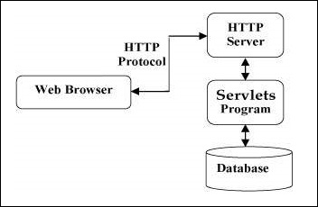

# Servlets - Overview

## 서블릿이 무엇인가? (What are sevlets?)

자바 서블릿은 웹이나 서버 앱에 실행되는 프로그램이고, 웹 브라우저나  
다른 http client와 DB 또는 HTTP server 사이에서 중간 단계 역할을 한다.

서블릿을 쓴다는 것은, 웹 페이지 폼에서 사용자의 입력을 수집할 수 있고,  
데이터베이스나 다른 소스로 부터 데이터를 표현할 수 있고, 웹 페이지를 동적으로 만들 수 있다.

자바 서블릿은 역시 다른 CGI를 구현한 프로그램들과 같은 것을 제공한다.  
하지만 CGI와 비교하여 여러가지 다른 장점도 있다.

- 성능이 훨씬 좋다.
- 서블릿은 웹 서버의 공간에서 실행된다. 즉, 각 client 요청을 처리하기 위해 프로세스를 분할하여 만들 필요가 없다.
- 서블릿은 자바로 작성 되었기 때문에, 플랫폼 독립적이다.
- 자바 보안 관리자가 서버 기기의 자원을 보호하기 위해 엄격한 제한 사항을 수행한다. 그래서 서블릿은 꽤 믿을만 하다.
- 서블릿에서 모든 자바 라이브러리가 사용 가능하다. 그것은 applets이나 database, socket, RMI 등 이미 작성한 java 코드와 통신할 수 있다.

## 서블릿 구조 (Servlets Architecture)

위와 같은 다이어그램은, 웹 앱 속에서 서블릿의 위치를 보여준다.

## 서블릿 작업 (Servlets Tasks)

서블릿은 아래의 작업을 핵심으로 수행한다.

- client에 보낸 명시적인 데이터를 읽는다. (웹페이지나 applets, 다른 http client의 form)
- 암묵적인 데이터를 읽는다. (cookies, media-types, 압축된 scheme 등 브라우저가 이해 가능한 그런 것들)
- 데이터를 처리하고 결과를 만든다. DB를 쓰거나, RMI을 실행하거나, CORBA 호출, 웹 서비스 호출, 직접적인 응답을 계산하는 것등.
- 브라우저에 명시적인 데이터를 보낸다. 데이터는 다양한 형태일 수 있다. (HTML이나 XML이나 binary거나)
- 브라우저에 암묵적 데이터를 보낸다. (cookies, cacheing parameters 등을 설정하거나 HTML를 반환하거나 등..)

## 서블릿 패키지 (Servlets Packages)

자바 서블릿들은 자바 서블릿 명세를 지원하는 인터프리터를 가진 웹 서버에서 실행되는 자바 클래스들이다.  
서블릿은 `javax.servlet`과 `javax.servlet.http` 패키지를 사용하면서 만들어 질 수 있다.  
(이것은 자바의 enterprise edition의 표준 부분이다)  
java enterprise edition은 프로젝트 개발에 있어 매우 큰 부분을 지원하는 하나의 확장된 버전이다.  

이 클래스들은 자바 서블릿과 JSP 명세들을 구현한다. 이 튜토리얼은 Java Servlet 2.5와 JSP 2.1로 작성되었다. (2005년 시점..)  

자바 서블릿은 다른 자바 클래스 처럼, 컴파일 되어야 만들어질 수 있다.  
아무튼, 자바 서블릿 패키지들을 받아야 쓸 수 있음.

## 다음으로는?

서블릿을 시작하기 위한 환경 설정을 한 단계씩 줄 것이다.  
아무튼 빨리 서블릿을 할 수 있을거임.  
난 너가 이것을 즐길 수 있다고 확신함.
