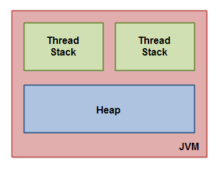
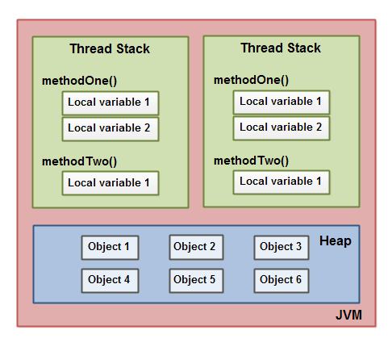
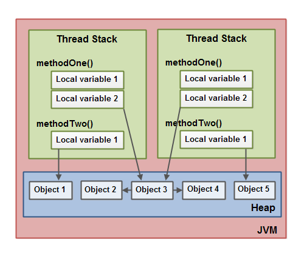
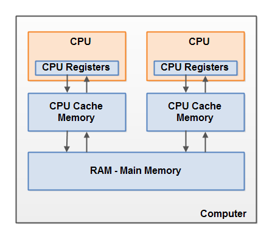
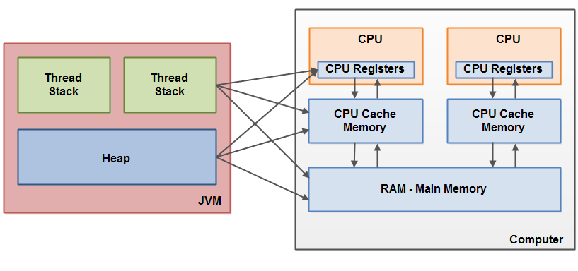
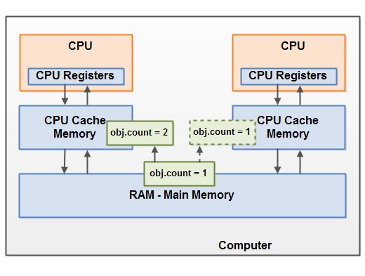

# 1. 스레드와 잠금장치  
스레드와 잠금장치는 모든 병렬적 아키텍처의 근간이 되는 기본이다.  
대부분의 언어들이 병렬적 제어를 위해 이를 제공한다.

실전 코드에서는 Thread를 직접 사용하는 일은 드물 것이다.  
하지만, 상위 수준의 내용을 이해하기 위해서는 기본이 되는 이러한 내용을 알아야 한다.

## 상호배제와 메모리 모델  
잠금장치를 사용하는 것은 한 번에 하나의 스레드만이 접근할 수 있도록 강제한다.  
이렇게 다른 공유 불가능하여 동시에 여러 스레드가 사용을 피하기 위한 알고리즘을 `상호배제(Mutual exclusion), Mutex`라고 한다.  
보통 critical section(임계 구역)이라 불리는 코드 영역에 의해 구현된다.

`Thread` : 하나의 논리적 흐름을 의미함  

### 공유 메모리 문제란?  
보통 값을 쓰기 위해서는 아래와 같은 프로세스를 통한다.  
    읽기 > 수정 > 쓰기

여기서 2개의 쓰레드가 동시에 읽기 과정에 오고, 수정을 진행했다고 하면,  
2를 더한 것이 아닌, 1을 더한 결과로 쓰기에 적용된다.  
즉, H/W 상에서 일어나는 일을 생각하면  
잘못된 결과를 만들어낸다.

그래서 `synchronized` 키워드를 이용하면 접근을 동기화 하므로,  
잠금장치를 이용하여 데이터 접근 시, 한 번에 하나의 쓰레드만이 접근할 수 있어  
이러한 문제를 해결할 수 있다.

## 메모리의 미스터리  
```java
answer = 42;
answerReady = true;
```
위 코드에서 어떤 라인이 먼저 실행이 될까?  
컴파일러나 CPU 실행 시, 어떤 것을 먼저 실행할지는 예측하기 어렵다.  
2번 째 줄이 먼저 실행 될 수도 있다는 것이 포인트다.

이는 컴파일러나 JVM, H/W에서 최적화를 수행하는 것이므로,  
이것 역시 메모리 문제를 일으킬 수 있다는 것.

## 메모리의 가시성  
값을 변경하는 메소드, 값을 읽는 메소드 2개가 있다면,  
모두 동기화를 시켜주어야 한다.  
아닌 경우, 값을 변경하는 중에 값을 읽어버려  
오래된 값을 보게될 수도 있다.  
이것은 문제가될 수 있다.

## 여러 개의 잠금 장치  
```java
synchronized (left) {
    synchronized (right) {
        // ...
    }
}
```
위 코드는 여러 개의 잠금장치를 적용한 예로,  
비효율적인 코드이면서 데드락이 발생할 가능성이 높아진다.  

이를 회피할 수 있는 방법은 아래와 같다.
    잠금장치에 사용할 개체를 미리 정해진 순서를 따르게 한다. (left와 right가 겹치지 않게끔)

## 외부 메서드의 위험  
종종 listener를 이용하여 여러 스레드에서 처리하는 경우가 있는데,  
이때도 역시 listener에 대한 동작을 동기화하고, 외부 메소드를 호출한다면  
데드락의 위험이 있다.

이를 피하기 위한 솔루션은 2가지가 있다.
- synchronized 메소드에서 외부 메소드 호출을 피하기
- 동기화 되는 영역을 한정지어 해결

# 정리  
잠금장치를 이용한 위험 요소 3가지를 알아봄.  
- 경쟁 조건
- 데드락
- 메모리 가시성

이를 피하기 위한 방법  
- 공유되는 메모리에 대한 접근 반드시 동기화
- 쓰는 쓰레드, 읽는 쓰레드 모두 동기화
- 여러 개의 잠금장치 이용 시 공통의 순서 주기
- 잠금장치 안에서 외부 메서드 호출X
- 잠금장치는 최대한 짧게 보유


# 자율학습  
- 윌리엄 푸의 자바 메모리 모델 웹사이트 확인  
link : http://www.cs.umd.edu/~pugh/java/memoryModel/

- JSR 133 FAQ  
link : http://www.cs.umd.edu/~pugh/java/memoryModel/jsr-133-faq.html

- 초기화 안정성 관련 자바 메모리 모델이 보장해주는 것

- thread 사이에서 개체를 안전하게 주고받기 위해 잠금장치가 항상 필요한가?

- double-checked locking 안티 패턴에 대해서

# 수행하라  
- 식사하는 철학자 예제를 직접 작성하기

- 동기화가 부재인 상태에서 메모리 적는 순서가 뒤바끼는 프로그램 작성  
  (자바 메모리 모델은 명령의 순서가 바뀌는 것을 허용하지만, 단순한 코드는 최적화 하지 않음)

## 자바 메모리 모델

### 자바 메모리 모델이 뭐야?  
멀티프로세서 시스템에는, 프로세들은 보통 1개 이상의 메모리 캐시 레이어들을 가진다. 이것은 데이터 접근 성능을 향상하기 위함과, 공유 메모리 버스 트래릭을 줄이기 위해서 한다.  
메모리 캐시들은 엄청나게 성능을 향상시킬 수 있지만, 캐시는 새로운 도전을 보여준다.  
예를들면, 2개 프로세서들은 같은 시간에 같은 메모리 위치를 검토하는지?  
그것들이 같은 값을 보게될 때 어떤 상태가 되는지?

프로세스 레벨에서는, 메모리 모델은 필요하고 충분한 상태들을 정의한다.  
그 이유는 다른 프로세서들이 현재 프로세스의 메모리를 작성하는 것과 현재 프로세서에서 다른 프로세스에 작성하는 것을 알기 위해서.  
몇몇 프로세들은 강력한 메모리 모델을 보인다.  

아무튼 메모리 모델은 멀티 프로세싱 환경에서 자바의 각기 다른 프로세서들이 어떻게 데이터를 주고 받는지, 조금 더 H/W레벨에서의 이야기라는 것 같음.  

영어로된 문서가 너무 길어서.. 한글 문서를 읽어야지..  
자바 메모리 모델은 어떻게 언제 쓰레드들이 공유 변수의 값을 볼 수 있는지 명시하고, 공유 변수로의 접근을 어떻게 동기화하는지 알려준다.

기존 자바 메모리 모델은 완전하지 못해서 JDK5에서 수정되었고,  
JDK8에서도 여전히 똑같은 모델을 이용한다고 한다.

## 자바 메모리 모델의 내부구조  
link : https://parkcheolu.tistory.com/14  
JVM에서는 내부적으로 메모리를 쓰레드 별 스택과 전체가 공유하는 힙으로 나눈다.


즉, 모든 쓰레드은 자기만의 스택 메모리와 콜 스택을 가지게 된다.  
쓰레드는 자신의 쓰레드 스택에만 접근할 수 있다.  
즉, 지역 변수는 공유가 불가능하다.  
만약 공유한다고 해도, 좋지 않은 상황이 일어날 것이다.  
지역 변수는 스택에 따라 잘 휘발되기 때문.  

여기서 원시 타입은 쓰레드 스택에 저장된다.
이것 역시 다른 쓰레드에서 전달한다고 해도, 원본 공유는 힘들다고 보면 된다고 한다.

heap 영역은 모든 개체들이 들어있다.  
지역 변수든 멤버 변수든 인스턴스들은 힙에 저장된다.



아무튼, 어떤 thread가 되었든 heap에 있는 것들은 참조가 가능하다.  


```java
public class MyRunnable implements Runnable() {

    public void run() {
        methodOne();
    }

    public void methodOne() {
        int localVariable1 = 45;

        MySharedObject localVariable2 =
            MySharedObject.sharedInstance;

        //... do more with local variables.

        methodTwo();
    }

    public void methodTwo() {
        Integer localVariable1 = new Integer(99);

        //... do more with local variable.
    }
}
```

```java
public class MySharedObject {

    //static variable pointing to instance of MySharedObject

    public static final MySharedObject sharedInstance =
        new MySharedObject();


    //member variables pointing to two objects on the heap

    public Integer object2 = new Integer(22);
    public Integer object4 = new Integer(44);

    public long member1 = 12345;
    public long member1 = 67890;
}
```

위 그림을 코드로 표현한 것이다.  

## 하드웨어 메모리 아키텍처  

위 그림은 실제 H/W가 구성하는 메모리 아키텍처이다.  
CPU는 레지스터 메모리를 가지고, 캐치 메모리, 그 다음으로 메인 메모리를 가진다.  
CPU에 가까운 메모리 레이어의 속도가 빠르다고 볼 수 있다.  

여기서 요즘 컴퓨터는 코어가 여러 개이므로,  
한번에 여러 쓰레드를 동시에 실행할 수 있다는 것을 의미한다.  
보통의 연산 동작은 이렇다.  

RAM > Cache > 레지스터 > 명령 처리 > 레지스터 > 캐시 > RAM  

캐시 데이터를 RAM으로 보내는 시점은, 데이터를 저장할 때라고 볼 수 있다.

## H/W 아키텍처와 자바 아키텍처의 연결


H/W는 쓰레드의 스택과 힙을 구분하지 않지만,  
실제 자바 머신은 이를 구분하여 동작을 하기에 이런 그림으로 볼 수 있다.  
java의 모든 메모리 레벨이 H/W의 다양한 영역에 존재할 수 있다는 것이다.  
이때 발생하는 문제는 2가지가 있다.  
- 공유 변수에 대한 쓰레드 업데이트(쓰기 작업)의 가시성  
- 공유 변수에 읽기, 확인, 쓰기 작업의 경합 조건

※ 메모리 가시성이란? : 한 thread에서 변경한 값이 다른 thread에서 제대로 읽어지는지
※ 메모리 장벽이란? : 캐시와 레지스터에 있는 값을 ram으로 옮기는 것.  
   적절한 시점에서 필요한 것임.
   일반적으로 lock을 사용하는 곳에 메모리 장벽이 설치된다.

추가로, AtomicInteger 같은 원자 변수들은 캐시나 레지스터에서의 메모리 가시성 문제를 해소하는 문제도 있다. (항상 RAM에 저장하도록 보통해주고, 컴파일러 순서 변경 문제도 해소한다.)

### 공유 개체의 가시성  
둘이상의 쓰레드가 volatile, synchronized 블록 없이 개체를 공유하면, 개체의 변경 사항이 다른 쓰레드에게 보이지 않는 상황이 있을 수 있다.


위 그림과 같이 cache 상에서만 값이 변경되어 있고,  
실제 RAM에는 전달되지 않는 문제.  

sync 블록을 이용하면 메모리 장벽으로 인해 가시성이 보장되고,  
volatile을 이용하면 메인 메모리로부터 수행하고,  
값 변경 시 메인 메모리에 반영하니 안전하다고 볼 수 있다.  

### 경합 조건  
여러 쓰레드가 한 개체를 공유하는 상황에서 한 쓰레드가 개체의 값을 변경할 때 발생한다.  
간단히 2 쓰레드가 동시에 개체 값을 1씩 증가시킨다고 보는 상황.

## double-checked locking은 좋지 않다.  
link : http://www.cs.umd.edu/~pugh/java/memoryModel/DoubleCheckedLocking.html
이것은 또한 멀티쓰레드의 싱글턴 패턴으로도 알려졌다.  
싱글톤 개체를 멀티 쓰레들에게 배포될 때 폭넓게 쓰이는 idiom이다.  
정확히는 개체의 lazy initialization (늦은 초기화)를 할 때 생기는 문제라고 보면 된다.

아래는 싱글 쓰레드를 위한 늦은 개체 초기화 패턴이다.

```java
class Foo { 
    private Helper helper = null;
    public Helper getHelper() {
        if (helper == null) 
            helper = new Helper();
        return helper;
    }
  // other functions and members...
}
```

위 코드는 멀티 쓰레드에서 동시에 호출된다면, 불필요 개체가 생성되게 된다. (즉 인스턴스가 여러 개가 생성될 수 있다.)  
helper가 null일 때, 들어온 3개의 쓰레드가 3번의 인스터스를 만들 수 있다는 의미이다.

```java
class Foo { 
    private Helper helper = null;
    public synchronized Helper getHelper() {
        if (helper == null) 
            helper = new Helper();
        return helper;
    }
  // other functions and members...
}
```

이를 방지하기 위해 이 메소드 자체를 synchronized로 할 수도 있다.  
이렇게 한다면 항상 호출될 때마다 synchronization을 수행하므로 굉장히 성능이 좋지 않게 된다.  
아래 코드와 같이 이중으로 체크된 locking을 쓴다면 피할 순 있다.

```java

// Broken multithreaded version
// "Double-Checked Locking" idiom
class Foo { 
    private Helper helper = null;
    public Helper getHelper() {
        if (helper == null) 
            synchronized(this) {
                if (helper == null) 
                    helper = new Helper();
            }
        return helper;
    }
  // other functions and members...
  }
```

위 코드가 바로 double-checked-locking 예가 된다.  
안타깝게도, 위 코드는 이론적으로 완벽하나 자바 메모리 모델의 문제로 제대로 동작하지 않게 된다.

`out-of-order write`  
new Helper()이 부분을 보면, JIT 컴파일러가 어떻게 이것을 실행할지를 봐야 한다.  
정확히는 2개의 쓰레드가 실행되었다고 할 때,
생성자를 통해 인스턴스가 만들어 지는 과정이 이렇다고 한다.  
non-null(반환) > 초기화  
즉, non-null은 완전히 개체가 사용할 수 있는 것은 아니고, 메모리 주소만 있는 상태이다.  
이때, thread1은 초기화 중이고, thread2는 이것을 보고는 바로 반환해버린다.

즉, 초기화가 완료 되지 않은 개체를 사용할 수 있다는 것이다.

jdk5부터 volatile이라는 키워드가 나왔지만, 그래도 이것이 완벽한 솔루션은 되지 않았음.  

적절한 방법은 static field를 이용한 자바가 보장해주는 초기화 방법을 이용하는 방법과 그냥 동기화 블록을 이용하는 것이다.

```java
// Works with acquire/release semantics for volatile
// Broken under current semantics for volatile
class Foo {
    private volatile Helper helper = null;
    public Helper getHelper() {
        if (helper == null) {
            synchronized(this) {
                if (helper == null)
                    helper = new Helper();
            }
        }
        return helper;
    }
}
```